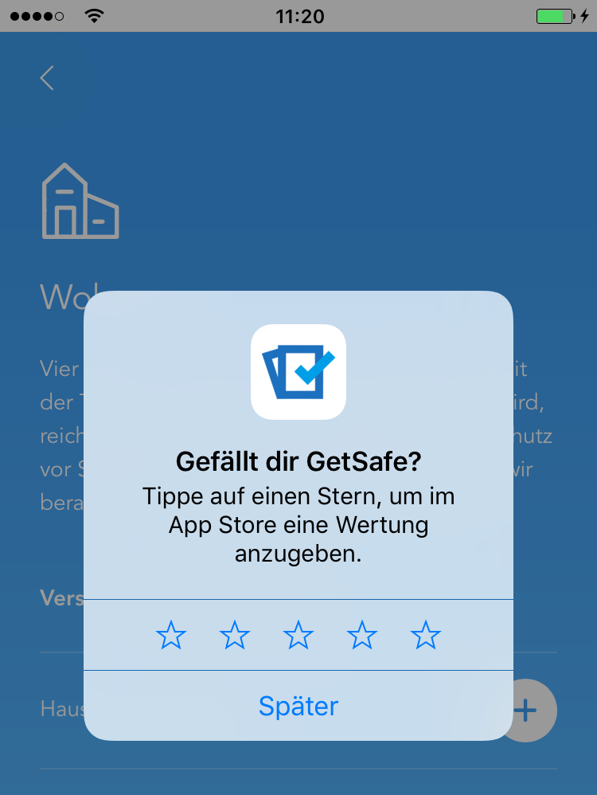

# cordova-plugin-requestreview

Cordova plugin to ask the user to rate or review your app, if appropriate.
The system handles the entire process for you.
**Supports iOS 10.3 and greater.**



## Installation

```
cordova plugin add https://github.com/cwelk/cordova-plugin-requestreview

```
For the plugin hooks to be working the ios platform needs to be re-installed
```

./rebuild_ios
```

## Note

Please not that by design there will be no feedback if the ratings modal is actually shown.

> Although you should call this method when it makes sense in the user experience flow of your app, the actual display of a rating/review request view is governed by App Store policy. Because this method may or may not present an alert, it's not appropriate to call it in response to a button tap or other user action.

[see the official documentation] (https://developer.apple.com/reference/storekit/skstorereviewcontroller/2851536-requestreview)

## Usage

```
RequestReview.try(supported, unsupported)
```

## Testing

> When you call this method while your app is still in development mode, a rating/review request view is always displayed so that you can test the user interface and experience. However, this method has no effect when you call it in an app that you distribute using TestFlight.

## License

MIT © [GetSafe] (http://www.getsafe.de), [Christian Welk](christianwelk83@gmail.com)
